

  <h1></h1> 

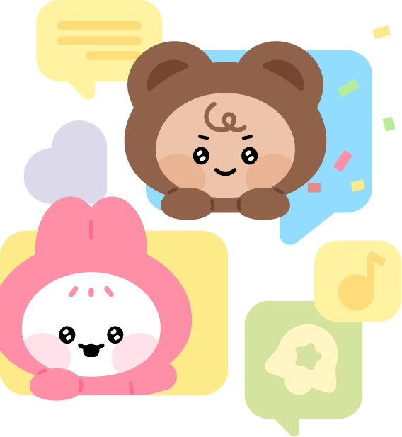

 

> 서비스 바로가기   > **https://www.moodmate.site**

 

  <a href="https://plum-lightyear-dd5.notion.site/MoodMate-328ba219563f46118193cd5d7a5acf8f?pvs=4">팀 노션</a>
  &nbsp; | &nbsp; 
  <a href="https://github.com/orgs/Leets-Official/projects/2">백로그</a>
  &nbsp; | &nbsp;
  <a href="https://www.figma.com/file/Pf9BoSgENbbP5DgxTFz7sg/MM-Design?node-id=1%3A2&mode=dev">figma</a> 
   

    

## 📄 목차

- [📄 목차](#-목차)
- [✍🏻 프로젝트 개요](#-프로젝트-개요)
- [⚙️ 기술 스택](#️-기술-스택)
- [🧡 FE 팀원 소개](#-fe-팀원-소개)
- [🖥️ 화면 구성](#-화면-구성)
- [🚀 핵심 기능](#-핵심-기능)
- [🏛️ 시스템 아키텍처](#️-시스템-아키텍처)
- [🔎 FE 기술적 도전](#-FE-기술적-도전)
  - [디자인 시스템 구축](#디자인-시스템-구축)

 

## ✍🏻 프로젝트 개요

MoodMate 무드메이트는 매일 밤 10시에 데이트 무드 취향, 나이와 학과 등을 고려하여 1대1 매칭을 해주는 서비스 입니다.
1:1 채팅은 매칭 시작 후 22시간, 다음날 오후 8시까지 유지됩니다.

 

## ⚙️ 기술 스택

<table>
    <thead>
        <tr>
            <th>분류</th>
            <th>기술 스택</th>
        </tr>
    </thead>
    <tbody>
        <tr>
            <td>
                  
프론트엔드

            </td>
            <td>
                  
                  
                  
                  
                  
            </td>
        </tr>
        <tr>
            <td>
                
백엔드

            </td>
            <td>
                
            </td>
        </tr>
        <tr>
            <td>
                
협업

            </td>
            <td>
                
                
            </td>
        </tr>
    </tbody>

</table>

 

## 🧡 FE 팀원 소개

|                                                             김나영                                                              |                                     신은지                                     |                                                             조혜원                                                             |
| :-----------------------------------------------------------------------------------------------------------------------------: | :----------------------------------------------------------------------------: | :----------------------------------------------------------------------------------------------------------------------------: |
|  |  |  |
|                                                             **FE**                                                              |                                     **FE**                                     |                                                             **FE**                                                             |
|                                         [@nayoung3669](https://github.com/nayoung3669)                                          |                   [@eunji0714](https://github.com/eunji0714)                   |                                          [@One-HyeWon](https://github.com/One-HyeWon)                                          |

 

## 🖥️ 화면 구성

### 회원 정보 입력

  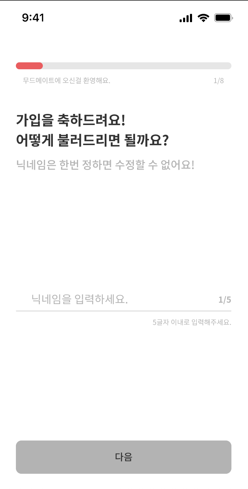  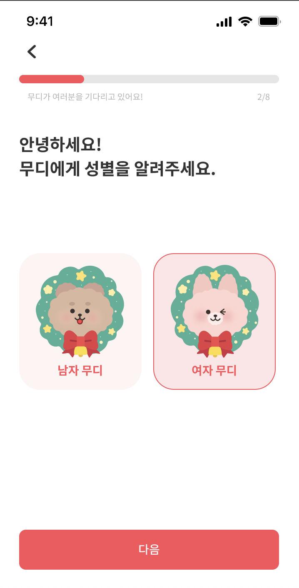  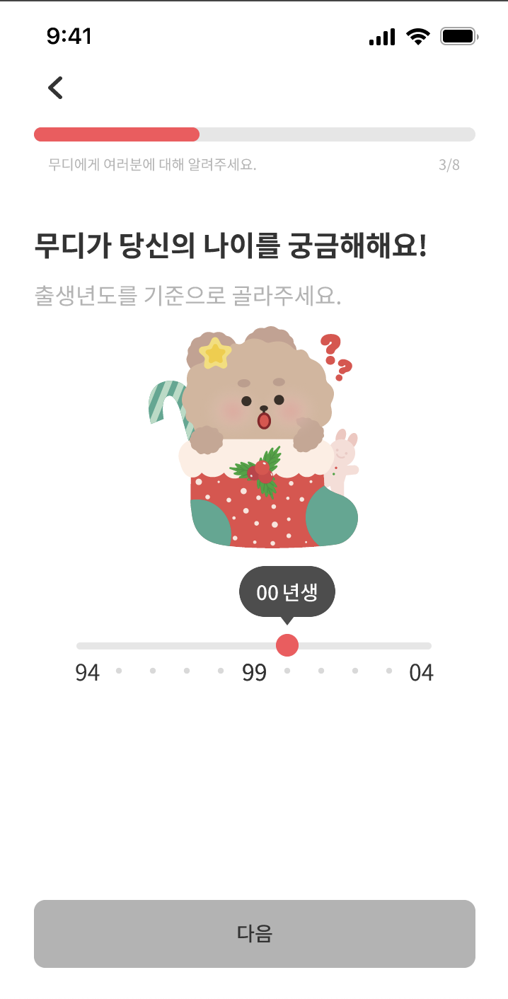

  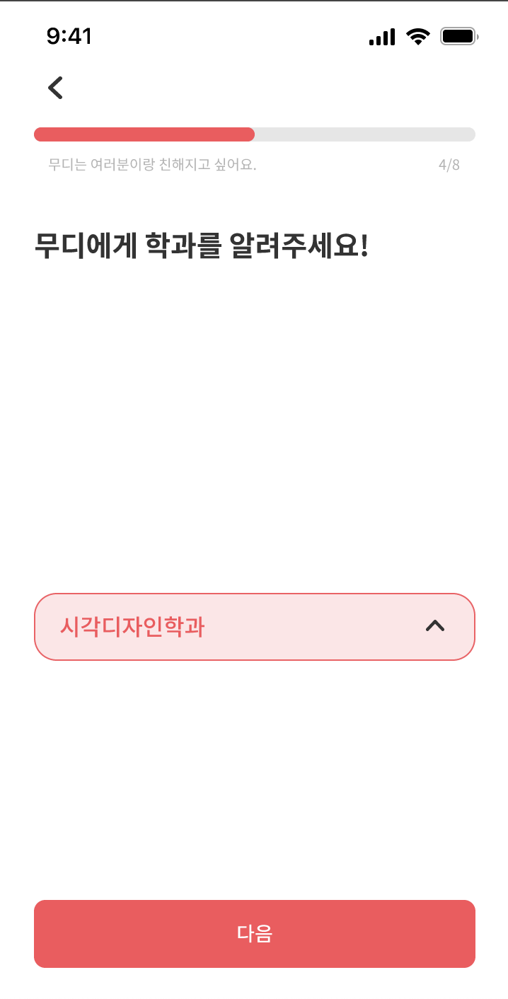  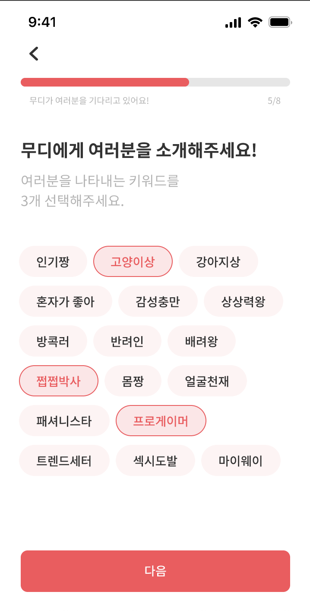

 

### 상대 무디 조건 입력

  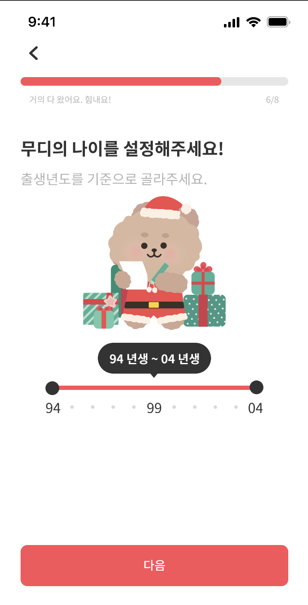  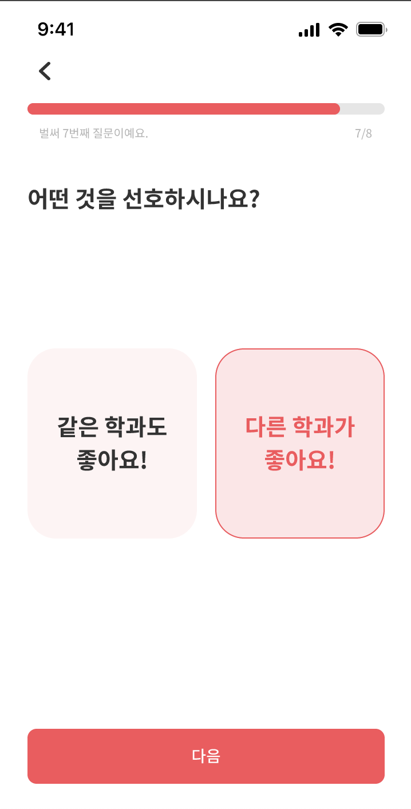  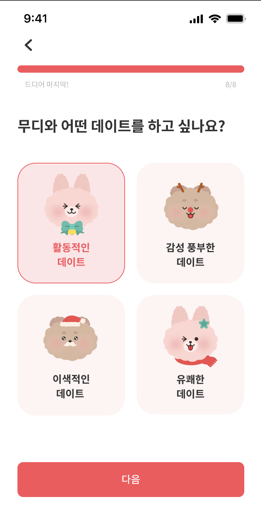

 

### 메인페이지

  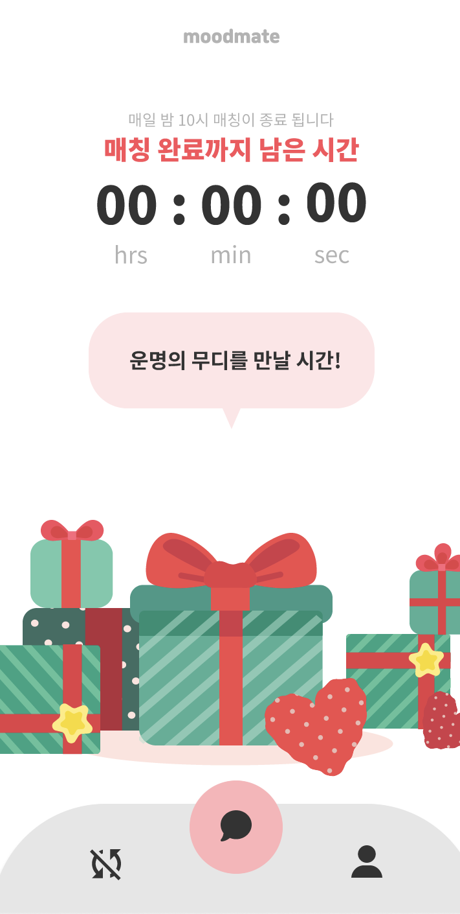 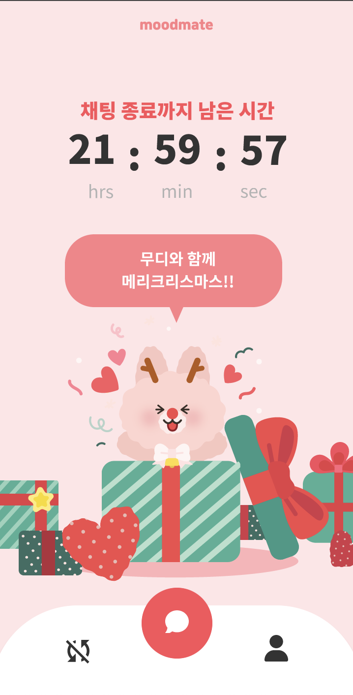  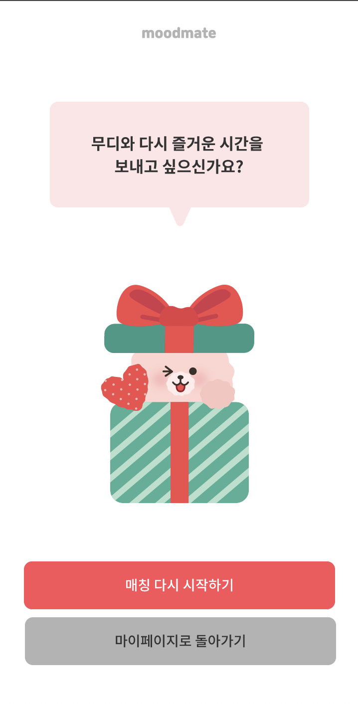<figcaption align="center">매칭대기중 | 매칭 후 채팅중 | 비활성화중 메인</figcaption>

### 채팅

  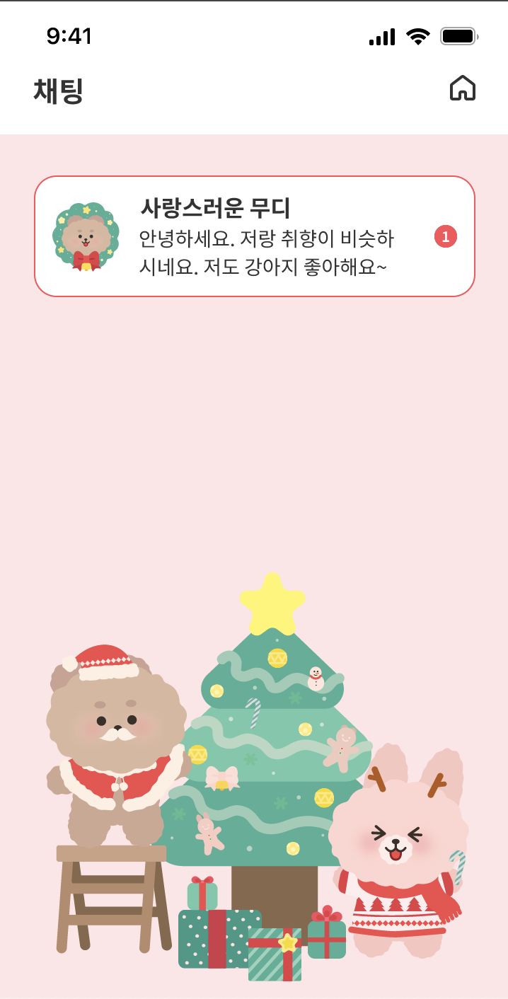 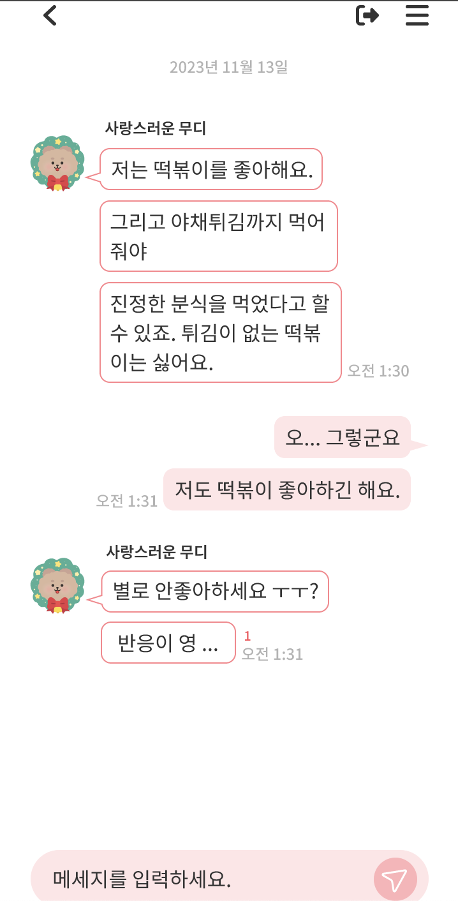  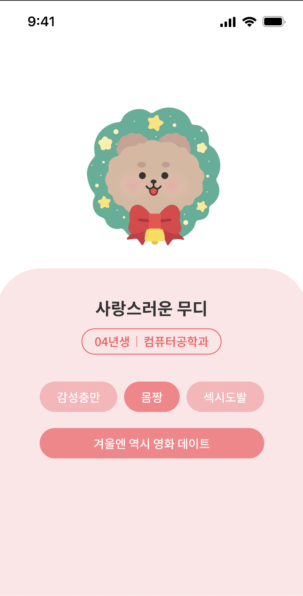<figcaption align="center">채팅 미리보기 | 채팅중 | 상대 무디 정보 조회</figcaption>

### 마이페이지

  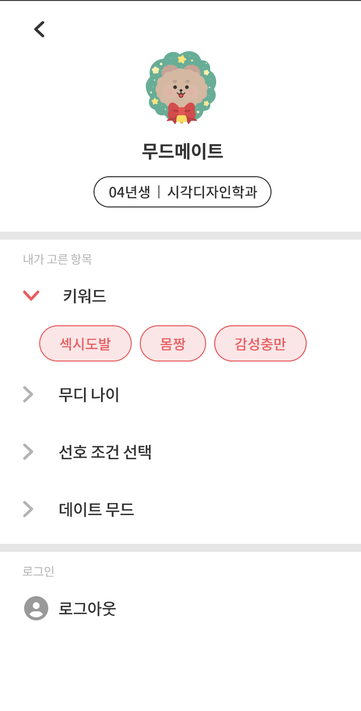

### 로그인페이지

  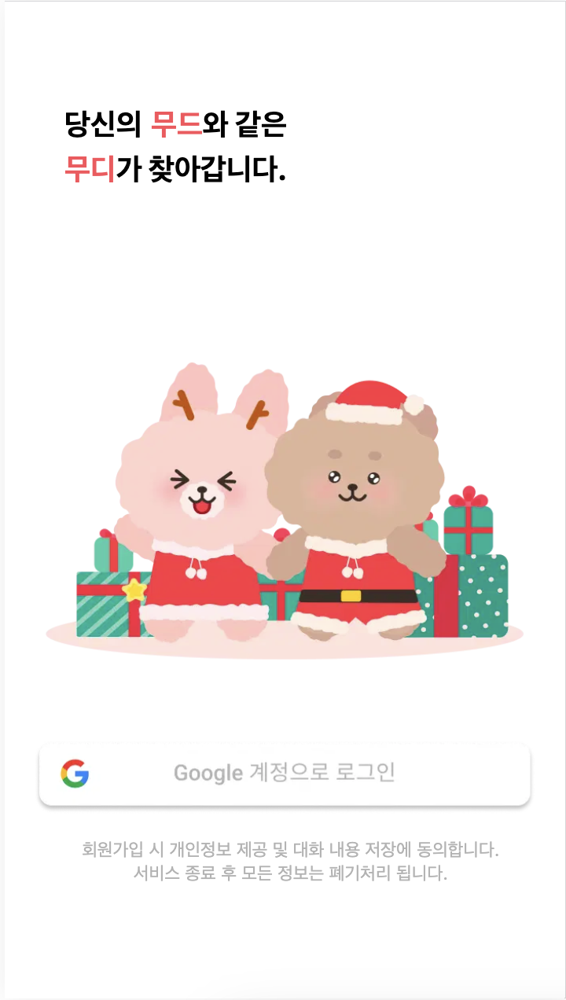

 

## 🚀 핵심 기능

### 매칭 시스템

> 유저가 설정한 데이트 무드, 나이 선호도, 같은 학과 선호 여부 고려

- 가중치 랜덤 알고리즘 방식으로, 매칭 여부를 활성화 한 경우 하루 한번 자동 매칭됨
- 유저가 매칭을 비활성화한 경우 활성화할 때 까지 매칭하지 않음

### 1:1 실시간 채팅

> 웹소켓과 Stomp 프로토콜을 이용한 1:1 채팅방 구현

- pub, sub 모델을 통한 양방향 통신 구현
- recoil 전역 상태 관리툴을 이용해 실시간 채팅이 올 때 마다 클라이언트 사이드에 저장함으로서 백엔드 api 요청 횟수 조절

### 채팅방 무한스크롤

> 리액트 쿼리와 IntersectionObserver를 활용한 무한 스크롤 구현으로, 사용자가 원할 때만 채팅 내용을 가져옴

- 유저가 스크롤을 위로 올리면 이전의 채팅이 설정한 사이즈만큼 보여짐
- 다음 페이지의 element가 없다면 더이상의 api 요청을 하지 않음
- 스크롤이 맨 위 또는 중간에 있을 때, 실시간 메시지를 송수신하면 스크롤이 가장 아래로 내려감

### 구글 소셜 로그인

> 서버에서 accessToken과 refreshToken을 발급받아 로그인을 진행함

- 토큰의 여부에 따라 접근할 수 있는 주소가 달라짐
- 로그인 직후 유저의 정보가 입력되어 있으면 메인페이지로, null이면 정보입력페이지로 redirect됨
- accessToken가 만료되면 refreshToken으로 accessToken을 재발급 받음

### 메인페이지 상태 변화 (+타이머)

> 매칭 여부에 따라 메인페이지의 UI가 변화됨

- roomActive에 따라 매칭 전후를 구분하여 알맞은 UI를 제공해줌 (색, 위치, 문구 등)
- 현재 시간을 가져와, 특정 시간(매칭 완료 시간, 채팅 완료 시간)까지 남은 시간을 메인페이지에 표시해줌
- 매칭 전 '채팅방 이동 버튼'을 누를 시 이동하지 않고 매칭 미완료 모달창 생성

### 마이페이지 카테고리

> 각 카테고리 제목을 클릭하여 본인이 입력한 정보 확인 가능함

- 항목을 토글로 만들어 보기 편리하게 만듦
- 제목, 아이콘, 내용 모두 컴포넌트로 만들어 재활용함

</aside>

 
